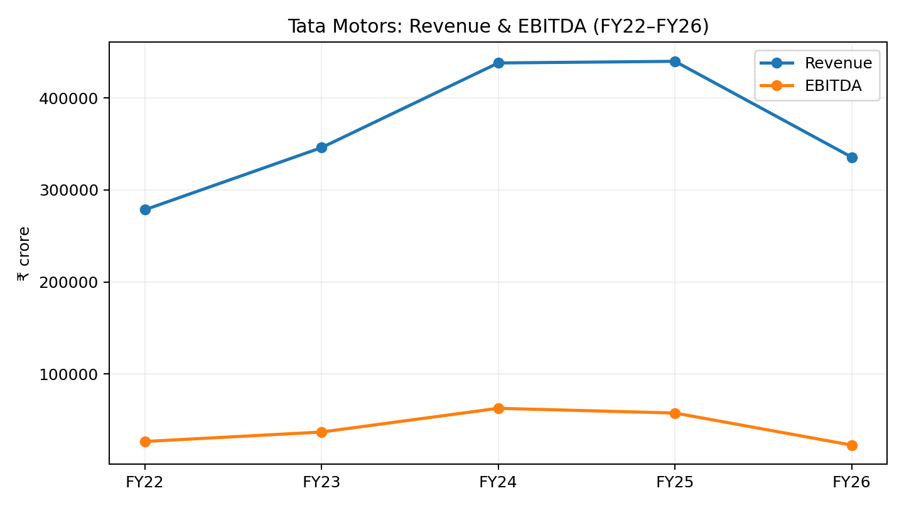
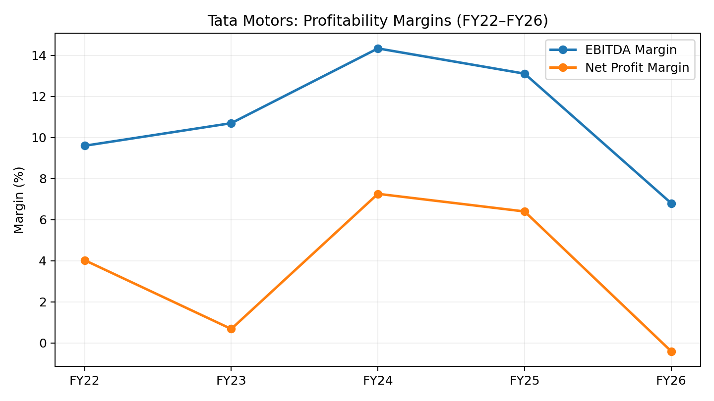
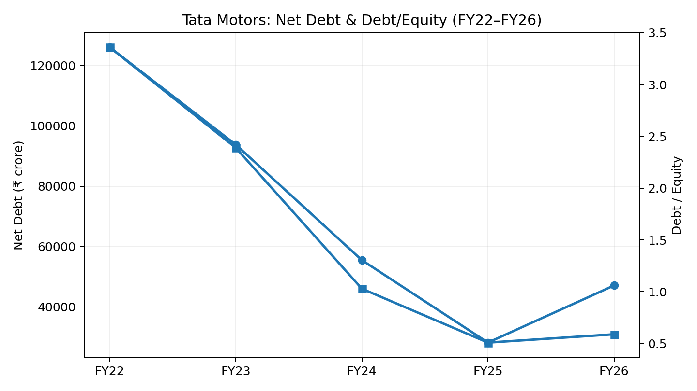
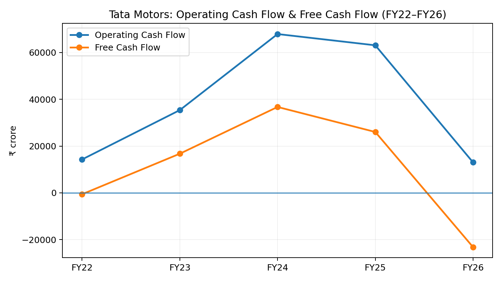

# Tata Motors — 5-Year Financial Performance & Valuation Analysis

A five-year consolidated financial analysis of **Tata Motors** covering FY2022–FY2026, examining profitability, leverage, cash flow, operating performance and valuation.

## Project Overview

This project evaluates how Tata Motors' financial performance and financial position evolved over five years using data collected from the company's published annual reports and related disclosures.

The analysis focuses on:

- Revenue and growth
- EBITDA and EBIT
- Profitability and margins
- Debt and leverage
- Operating cash flow and free cash flow
- Assets and equity
- EPS and shareholder returns
- Vehicle sales
- Fundamental valuation

## Research Objective

> **How did Tata Motors' financial performance and financial position evolve between FY2022 and FY2026, and what does the analysis suggest about the company's underlying financial strength and valuation?**

## Analysis Period

**FY2022 – FY2026**

Financial figures are presented primarily on a **consolidated basis**, with the reporting basis considered when interpreting individual metrics.

---

## Key Areas of Analysis

### 1. Revenue & Growth

Examines Tata Motors' revenue trajectory and growth across the five-year period to understand changes in business scale.

### 2. Profitability

Analyzes:

- EBITDA
- EBIT
- Profit Before Tax
- Net Profit
- EPS
- EBITDA Margin
- EBIT Margin
- Net Profit Margin

### 3. Balance Sheet & Leverage

Evaluates changes in:

- Total Assets
- Total Equity
- Total Debt
- Cash & Cash Equivalents
- Debt-to-Equity
- Overall financial leverage

### 4. Cash Flow

Examines:

- Operating Cash Flow
- Capital Expenditure
- Free Cash Flow
- Cash generation relative to reported profits

### 5. Operating Performance

Includes vehicle sales and other operating indicators where reliable historical data was available.

### 6. Valuation

The project considers fundamental valuation metrics alongside financial performance to assess the company's financial profile.

---

## Key Metrics

| Category | Metrics |
|---|---|
| Revenue | Revenue, Revenue Growth |
| Profitability | EBITDA, EBIT, PBT, Net Profit |
| Margins | EBITDA Margin, EBIT Margin, Net Profit Margin |
| Balance Sheet | Assets, Equity, Debt, Cash |
| Cash Flow | Operating Cash Flow, CapEx, Free Cash Flow |
| Returns | EPS, ROE, ROCE |
| Valuation | P/E, EV/EBITDA, EV/Sales |
| Operations | Vehicle Sales |

---

## Visual Analysis

### Revenue & EBITDA



### Profitability Margins



### Debt & Leverage



### Operating Cash Flow & Free Cash Flow



---

## Methodology

The analysis follows a structured financial-analysis workflow:

**Annual Reports → Data Collection → Data Cleaning → Financial Analysis → Ratio Analysis → Cash Flow Analysis → Valuation → Interpretation**

The financial dataset was compiled from Tata Motors' published annual reports and related company disclosures.

The analysis uses historical financial information to identify trends, changes in financial strength and areas requiring further investigation.

---

## Project Deliverables

This repository contains:

- Five-year financial dataset
- Financial statement analysis
- Profitability analysis
- Ratio analysis
- Cash flow analysis
- Valuation analysis
- Financial visualizations
- Detailed case study report

### Full Case Study

**[Read the Tata Motors Case Study](report/Tata_Motors_Case_Study_FY26_Corrected.pdf)**

### Financial Dataset

**[View the Tata Motors FY22–FY26 Analysis](Tata_Motors_5Y_Analysis.xlsx)**

---

## Tools Used

- Microsoft Excel
- Financial Analysis
- Financial Modelling
- Data Visualization
- Annual Report Analysis

---

## Data Sources

Primary sources include:

- Tata Motors Annual Reports
- Tata Motors company disclosures
- Published financial and operating information

The analysis prioritizes company-reported consolidated financial information where applicable.

> Financial figures should always be interpreted together with the reporting basis, accounting definitions and disclosures in the relevant annual reports.

---

## Repository Structure

```text
tata-motors-financial-analysis/
│
├── README.md
├── LICENSE
│
├── Tata_Motors_5Y_Analysis.xlsx
│
├── report/
│   └── Tata_Motors_Case_Study_FY26_Corrected.pdf
│
└── visuals/
    ├── revenue_ebitda.png
    ├── profitability_margins.png
    ├── debt_leverage.png
    └── cash_flow_fcf.png
